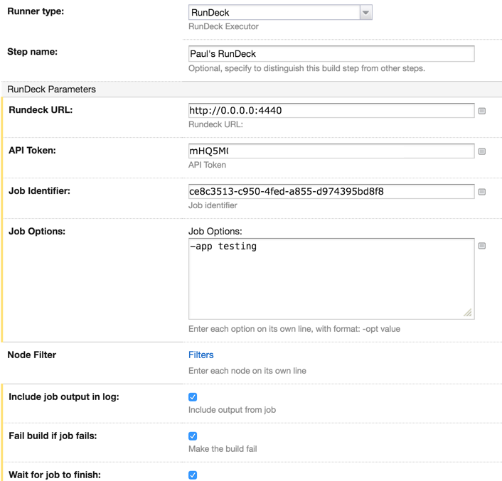

##RunDeck 

TeamCity RunDeck plugin to run RunDeck jobs

- Allows to pass options to jobs and filter nodes
- Currently does not provide output of log executions but it's planned

###Installation

You can download the plugin from the [TeamCity Server](https://teamcity.jetbrains.com/viewType.html?buildTypeId=TeamCityPluginsByJetBrains_TeamcityRunDeck_Build)
. Simply download the zip and install it on your TeamCity server.

####Build Status

###Configuration

###TODO

- Log execution output
- Fix service messages

###License

MIT. 
